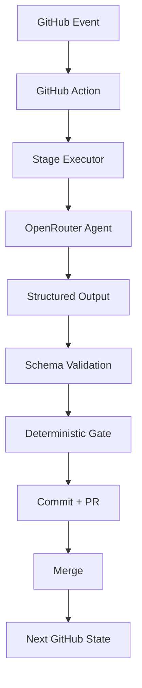

# SaaS Ideas — Git-Native Multi-Agent Opportunity Discovery Engine

A Git-native, multi-agent system that continuously discovers rare global B2B SaaS opportunities backed by strong external evidence.

## What It Does

- Continuously mines real painful workflows from diverse online sources
- Clusters pain signals into canonical Jobs-to-be-Done
- Validates burning need intensity through skeptical scoring
- Researches competition exhaustively
- Runs adversarial Bull/Bear/Customer debates
- Applies deterministic hard gates and scoring
- Produces ranked opportunity reports

## What It Deliberately Does NOT Do

- Generate startup ideas from thin air
- Propose solutions before validating pain
- Confuse "no competition" with "no market"
- Fill top-10 slots with weak candidates
- Require human intervention between pipeline stages

## Architecture



### Pipeline

```text
DISCOVERY RUN
     ↓
PARALLEL PAIN MINING (4 workers)
     ↓
CLUSTERING + DEDUPLICATION
     ↓
PAIN VALIDATION
     ↓
COMPETITION ELIMINATION
     ↓
BULL ─────┐
BEAR ─────┼── parallel, independent
CUSTOMER ─┘
     ↓
FINAL JUDGE
     ↓
DETERMINISTIC HARD GATES
     ↓
DETERMINISTIC RANKING
     ↓
TOP OPPORTUNITIES REPORT
```

### State Machine

```text
created → pain_mining → clustering → validating → competition_checking → debating → judging → completed
                                                                                          → failed
                                                                                          → cancelled
```

## Repository Structure

```
/
├── agents/              # Agent system prompts (Markdown)
│   ├── pain-miner.md
│   ├── clusterer.md
│   ├── validator.md
│   ├── competition.md
│   ├── bull.md
│   ├── bear.md
│   ├── customer.md
│   └── judge.md
├── config/
│   └── config.yaml      # All operational tuning
├── research/
│   ├── runs/            # Run manifests (JSON)
│   ├── raw-signals/     # Raw pain signals
│   └── clusters/        # Clustered JTBDs
├── opportunities/
│   └── OP-XXXX/         # Per-opportunity artifacts
│       ├── problem.json
│       ├── evidence.json
│       ├── validation.json
│       ├── competition.json
│       ├── bull.json
│       ├── bear.json
│       ├── customer.json
│       └── verdict.json
├── reports/
│   ├── TOP-10.md
│   ├── REJECTED.md
│   └── archive/
├── src/
│   ├── agents/          # Agent executors
│   ├── cli/             # Stage CLI entry points
│   ├── dedupe/          # Duplicate detection
│   ├── gates/           # Deterministic hard gates
│   ├── github/          # GitHub integration utilities
│   ├── openrouter/       # OpenRouter LLM provider
│   ├── reporting/        # Report generation
│   ├── research/         # Research provider interface
│   ├── schemas/          # Zod schemas
│   ├── scoring/          # Deterministic scoring
│   └── state/            # State management
├── tests/
│   ├── fixtures/        # Test fixtures (A-H)
│   ├── unit/            # Unit tests
│   ├── integration/     # Integration tests
│   └── e2e/             # End-to-end simulation
└── .github/
    ├── ISSUE_TEMPLATE/
    └── workflows/       # 12 GitHub Actions workflows
```

## Setup

### Prerequisites

- Node.js 22+
- npm
- A GitHub repository
- An [OpenRouter](https://openrouter.ai) account and API key

### Required GitHub Secret

```
OPENROUTER_API_KEY
```

### GitHub Permissions

The workflows require:
- `contents: write` — to commit research artifacts and reports
- `issues: write` — for idempotent label creation
- `pull-requests: write` — for PR-based state transitions (future)

### Quick Start

```bash
# Clone the repository
git clone <your-repo-url>
cd saas-ideas

# Install dependencies
npm install

# Validate setup
npm run bootstrap
```

Expected output:
```
✓ config/config.yaml loaded successfully
✓ Models configured: 8 agents
✓ Required directories created
✓ OPENROUTER_API_KEY is set
✓ Repository is ready for discovery runs.
```

## Configuration

All thresholds are in `config/config.yaml`:

- **Models**: Primary and fallback models per agent role
- **Research**: Ecosystems, signal counts, candidate limits
- **Gates**: Minimum scores for each dimension
- **LLM**: Temperature, timeout, retry settings
- **Budget**: Max cost per run
- **Schedule**: Cron expression

## Running

### Bootstrap (idempotent)

```bash
npm run bootstrap
```

Creates labels, validates config, checks secrets, creates directories. Safe to run repeatedly.

### Manual Discovery

Via GitHub Actions: **Actions → Discovery → Run workflow**

Or locally:
```bash
npm run discovery
```

### Scheduled Discovery

Configure the cron in `config/config.yaml`:

```yaml
schedule:
  enabled: true
  cron: "0 0 * * 0"  # Weekly on Sunday
```

### Stage Recovery

If a stage fails, recover from any point:

**Actions → Recovery → Run workflow**

Select the run ID and stage to resume from.

## Model Selection

Edit `config/config.yaml` to set primary and fallback models per agent:

```yaml
models:
  pain_miner:
    primary: "anthropic/claude-3.5-sonnet"
    fallbacks:
      - "openai/gpt-4o"
```

Supported models include any [OpenRouter model](https://openrouter.ai/models).

## Adding a Research Ecosystem

Edit `config/config.yaml`:

```yaml
research:
  ecosystems:
    - github-issues
    - reddit
    - your-new-ecosystem
```

## Cost Controls

Set a budget in `config/config.yaml`:

```yaml
budget:
  max_cost_per_run_usd: 5.00
```

Cost estimation uses known model pricing from OpenRouter. Unknown models report cost as null without blocking.

## Security Model

- **Least privilege**: Workflows request only needed permissions
- **Prompt injection defense**: All 8 agent prompts include explicit instructions to treat web content as data
- **Path validation**: Generated file paths validated against allowed directories
- **No secrets in commits**: OPENROUTER_API_KEY never written to disk
- **Untrusted output**: All model output validated through Zod schemas before use
- **No shell execution**: Agents never execute generated commands

## Limitations

- Research is LLM-based (no real-time web scraping)
- Cost estimation depends on known pricing data
- Semantic deduplication is a placeholder (deterministic only for MVP)
- No real-time monitoring or alerts
- Reports are Markdown files only (no dashboard)

## Troubleshooting

| Problem | Solution |
|---------|----------|
| `OPENROUTER_API_KEY not set` | Add the secret to GitHub or `.env` |
| `Config error` | Validate YAML syntax in `config/config.yaml` |
| `No run manifests found` | Run `npm run discovery` first |
| `No raw signals found` | Pain mining stage must complete before clustering |
| Stage timeout | Increase `timeout_seconds` in config, or use a faster model |
| Budget exceeded | Increase `max_cost_per_run_usd` or set to `null` |
| Zero opportunities | Valid outcome — system optimizes for truth, not volume |

## Development

```bash
npm install          # Install dependencies
npm run typecheck    # Strict TypeScript check
npm run lint         # ESLint
npm run format       # Prettier check
npm run format:fix   # Prettier auto-fix
npm test             # Unit tests (76)
npm run test:integration  # Integration tests (14)
npm run test:e2e     # E2E simulation (24)
npm run build        # Compile TypeScript
```

## Scoring Formula

```
need = weighted_mean(pain, frequency, urgency, economic_impact, operational_impact, workaround_intensity)
commercial = weighted_mean(willingness_to_pay, distribution)
market = weighted_mean(global_applicability, evidence_quality)
penalty = competition_penalty × mvp_complexity_penalty
final = 100 × need × commercial × market × penalty
```

All weights are documented in `src/scoring/index.ts`. Penalty functions are monotonic — higher competition/complexity always lowers the score.

## License

MIT
